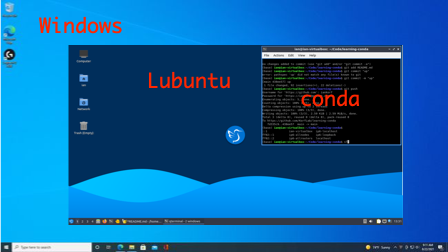

Setup
=====

This is a best practices document to set up your bioinformatics environment in
the Korf Lab.


Overview
--------

Some of these things sound painful. Not doing them will become more painful.

### Rule #1: Create Test/Dev Data

Before you start on a project, the most important thing to do is to build a 
minimal dataset for development and testing. We call this our "test set" or 
"dev set". We do this for several reasons.

+ Minimize debugging time
+ Functional tests
+ Tutorials

Software development takes much more time than you expect. The debugging stage 
can be very long. In order to reduce the downtime between debugging sessions, 
we need a small data set that can be processed very quickly.

Software changes over time. Even if we make no changes to our code, our 
software depends on other software, which may change silently. In order to 
ensure that our software continues to produce the same output as before, we 
must perform "functional tests" that automatically compare the current output 
to the previous, expected output.

When it comes time to distribute our software, there should be a tutorial that
shows how to use the software. The test data is useful here and also to ensure
that the software passes the functional tests at another location.

Making test data can take some time. For example, let's imagine your project 
involves RNA-seq on the human genome. What is the proper test set? Not the 
entire human genome and 10 RNA-seq libraries. The test set should fit neatly 
into the github repository where the code lives. Ideally, the entire repo is 
small. Under 100M is good. Under 10M is better. 1M is ideal. Creating a test 
set for an RNA-seq project means making a miniaturized version of the human 
genome and curating some reads that align to that part of the genome. 
Obviously, the region of the genome matters. You probably want some areas with 
high coverage and some areas with low coverage. It may take a week to create a 
test set. And later, you may have to make a better one. This part of our work 
is sort of like making reagents and calibrating instruments. It's a pain but 
must be done to ensure reproducibility.

### Do's

+ Keep all of your code in github
+ Put test data in your github repo
+ Develop and test software in a virtual machine
+ Manage software with conda
+ Create and perform functional tests regularly
+ Destroy and re-build VMs from time to time
+ Put a README in every directory
+ Have someone else run your code/pipeline
+ Adhere to best practices as much as possible
+ Read the `RER.md` document in this repo

### Don'ts

+ DO NOT develop software on the cluster, use a VM
+ DO NOT develop software in your main OS, use a VM
+ DO NOT install analysis software via the operating system, use conda
+ DO NOT write/save scripts near data, separate code from data
+ DO NOT use filenames as metadata, write documents
+ DO NOT trust anything to memory, write documents
+ DO NOT justify bad practices with, "I was just..."
+ DO NOT work alone


Bioinformatics Development Environment
--------------------------------------

Our development environment uses the following technologies.

+ Host OS (Windows or Mac desktop or laptop)
+ Linux Virtual Machine (e.g. VirtualBox running Lubuntu)
+ Conda (for software management)



### Linux Virtual Machine

Most professional bioinformatics is done in a Unix/Linux environment. While
MacOS is based on Unix, and Windows now has built-in support for Linux, it's
better to work inside a Linux virtual machine (VM). Why?

+ Your products will be more portable
+ You can protect your host OS from running out of memory
+ You can protect your host filesystem from running out of storage
+ You can't destroy your host computer from stupid things you might do
+ You can avoid overly protective host OS securities

What are the downsides of running a VM?

+ You have to install VirtualBox or some other software
+ You have to split RAM between your host and VM
+ Programs running inside the VM may be a little slower (maybe 10%)

The downsides are trivial problems. When you're developing software and
pipelines, you don't need much RAM or space. If you find that's not true, you
need to go back and review Rule #1.

### Darwin, WSL, Cygwin, RPi, etc

Programming in multiple environments will make your code more robust. Once you
get everything set up in a Linux VM, go ahead and also program in other
operating systems. The built-in support for Darwin (the name of Unix on Mac) and
WSL (Windows Subsystem for Linux) is pretty attractive. There are other
Unix-like environments that are also useful like Cygwin and Gitbash. You may
find it fun to program on a Raspberry Pi or in Haiku. Just don't make any of
these alternative environments your _only_ environment.

### Conda

Within the VM, we manage our software with Conda. Does it sound wasteful that 
the host OS has Python, the VM has Python, and yet we override both of those 
and run Python from Conda? Yes, it is wasteful. However, it's also something we 
control ourselves. The host OS might update its Python and break our code. The 
VM may update its Python and break our code. There are many things aside from 
Python that may change and break our code. Conda allows us to control all of 
our software dependencies.

You don't need root/superuser access to install software with Conda. This saves
both your time and the sysadmin's time. The extra storage space used is a small
price to pay for reproducibility and time savings.


VM Installation
---------------

Q: Which Linux distribution should I use?

A: It doesn't really matter. The Linux distributions designed for older hardware
use less resources. Lubuntu and Linux Lite are two excellent choices.

These instructions assume you will be installing a Lubuntu Linux distribution
on a Windows computer using VirtualBox. It's not very different with other
distributions or MacOS.

Stuff you will need:

+ Lubuntu https://lubuntu.me
+ VirtualBox https://www.virtualbox.org

Actions you will take:

1. Download Files
2. Create Virtual Machine
3. Install Lubuntu
4. Install Anaconda
5. Post-install Tweaks

### Troubleshooting

If you follow the instructions below and you get stuck, ask for help.

Some Windows computers are not set up for virtualization. You may need to
change some BIOS settings.

MacOS may require changing some security settings.

### 1. Download files

Download the latest Lubuntu or equivalent distribution. The file will be named
something like "lubuntu-21.10-desktop-amd64.iso". It's about 2GB.

Download VirtualBox. It's much smaller. Run the installer.

### 2. Create Virtual Machine

Click the "New" button to create a new VM. You can name it anything. I used
Lubuntu-21.10 because that's what I downloaded. Choose a location. Sometimes I
use the default, but sometimes I choose an external drive. The type is Linux and
the Version is Ubuntu (64-bit).

Assign the VM 2G Memory. The install might not work well with less and doesn't
need any more. You can change the amount of memory and the number of CPUs
later.

Create a virtual hard disk using the default VDI and dynamic allocation. Set
the size to 40G. Because of the dynamic allocation, you will only use about 10G
in Windows. For software development and testing purposes, you will probably
not need more than 40G. You might think it's a good idea to set the limit
higher just in case, but it's easy to write a program that spams output and
fills up your filesystem with junk. In such cases, it's better to have 40G of
junk than 500G.

### 3. Install Lubuntu

In "Oracle VM VirtualBox Manager" scroll down until you see "Storage". Click on
the Optical Drive, and connect it to the Lubuntu iso image you downloaded
earlier.

Press the "Start" button. Soon you will see a typical computer desktop that
looks a little like Windows.

Double-click on the "Install Lubuntu" icon on the desktop.

Click "Next" a couple times. When in doubt use the default parameters. When it
shows you the option to Erase disk, click the radio button. You cannot erase
your Windows disk. This is erasing the virtual disk you just made. Click
"Next".

Enter your name and username any way you like. Click the box to log in
automatically. Your Windows OS already has a password. You don't need another
one to get to the Linux running inside Windows. Click the "Install" buttons and
wait a few minutes while Lubuntu installs.

Click the Restart button when it asks you to. After a little while it will tell
you to remove the instllation medium and then press Enter. Just press Enter.

------------------------------------------------------------------------------

After you see the Lubuntu desktop again, click on the Devices menu at the top.
Select "Insert Guest Additions CD image...". It probably wont' autorun
properly, so we have to do this the manual way.

Click on the bird icon in the lower left of the screen. This is the Start Menu.
Under "System Tools" you will find "QTerminal". Run that. Right now, the
Lunbuntu desktop may be really small. We'll fix that later. To make sure you
can see all the terminal output, click the QTerminal's maximizing icon (looks
like 2 triangles).

Change directory to the location of your optical drive. For me, it looks
something like this.

	cd /media/ian/VBox_GAs_6.1.30

You need to run the post-install script as the super-user.

	sudo sh VBoxLinuxAdditions.run

Enter your password and wait for the script to complete. Shutdown the VM by
clicking the Start Menu and choosing Leave->Shutdown.

-----------------------------------------------------------------------------

Back in Oracle VM VirtualBox Manger, Select the "Settings" button.

Select the "General" tile and then click on the "Advanced" tab. Set the Shared
Clipboard to Bidirectional.

Select the "System" tile, you can change the amount of memory and the number of
processors. For software development, you can keep the 2G RAM and 1 CPU, but if
you're doing pipeline development, you may want more RAM and more CPUs. You
should always leave Windows about 4G RAM and 2 CPUs.

Select the "Storage" tile. Click on the Optical Drive and remove the
VBoxGuestAdditions.iso.

-----------------------------------------------------------------------------

Press the Start button again. Things that now work.

+ Resize the screen by click-n-drag to whatever you like
+ Copy-paste from Windows to Linux and back

### 4. Install Anaconda

Open Firefox in your VM and head to https://www.anaconda.com to download
Anaconda. Next open your QTerminal and navigate to your Downloads folder. Run
the shell script there (the example shown below might not be the same).

	cd Downloads
	sh Anaconda3-2021.11-Linux-x86_64.sh

Read the license agreement and answer "yes" (without quotes) to accept the
terms. Use the default location for the install by pressing Enter. It will take
a little time to install. When the installer asks if you want to initialize
Anaconda3 by running conda init, answer "yes".

Close your terminal and open a new one. You should see `(base)` at the start of
each prompt. This means you're in the base `conda` environment. When you
install new bioinformatics programs or even programming languages, use `conda`
to do that for you.

For more information about `conda` see the KorfLab/learning-conda repo.

You can now remove the Anaconda install file from your Downloads folder.

### 5. Post-install Tweaks

You will use the QTerminal application all the time. To make it easy to get to,
click-n-drag its icon to the Menu Bar at the bottom of the screen (the
application is in "System Tools").

The default text editor is called FeatherPad, which can be found in the
Accessories menu. You can click-n-drag that to the Menu Bar if you like it.
However, you might want to install something else, as editors can be very
personal things.

Open the QTerminal application and create a new directory for your Code.

	mkdir Code

Make a couple directories there.

	cd Code
	mkdir bin lib

Grab the KorfLab setup repository.

	git clone https://github.com/KorfLab/setup

You will probably want to put some aliases and environment variables in your
`.bashrc`. For example, I use these conveniences.

```
alias ls="ls -F"
alias lst="ls -lrth"
alias cls="clear; ls"
alias ..="cd .."
alias gs="git status"

PATH=$PATH:$HOME/Code/bin:$HOME/go/bin
export PYTHONPATH=$PYTHONPATH:$HOME/Code/lib
export PERL5LIB=$PERL5LIB:$HOME/Code/lib
```

You can copy-paste these to your login script or better yet, `source` them in
from the setup repo. Put a line like this at the end of `.bashrc`, after your
conda initialization.

	source $HOME/Code/setup/profile

-----------------------------------------------------------------------------

This part is optional. If you want to share files between your host OS and your
VM, you need to set up a shared folder. Why would you do this?

+ You have large-ish data files you don't want to copy to the VM
+ Your favorite editor is only available on your host OS

Select the "Shared Folders" tile. Click on the folder with the + sign at the
far right to make a new shared folder.

The "Folder Path" is the folder on your host OS (Windows). Navigate to the
folder you want to share. If it doesn't exist, create it. The Folder Name
should auto-populate.

The "Mount Point" is where you want the folder to show up in your VM. For 
example, if you wanted to share a data directory from your host OS, you might 
use a mount point of `/home/$USER/Data`, which would show up in your Lubuntu 
home, or `/data`, which would be off the filesystem root.

Check Auto-mount and Make Permanent. If the shared directory is strictly data,
you might mount it Read-only, but if it's code, then definitely not.

After clicking OK, you should be able to see the directory in your VM. However,
you don't have permission to use it. Add yourself to the vboxsf group with the
following command.

	sudo adduser $USER vboxsf

You have to restart for the changes to take effect.

-----------------------------------------------------------------------------

At some point, Lubuntu will ask you if you want to apply updates. Sure, it's 
always a good idea. If you don't want to wait, you can go to Start Menu -> 
Preferences -> Apply Full Upgrade. This may increase the amount of space you VM 
takes up. Again, a little space is a small price to pay for robustness and 
reproducibility.


Directory Structure
-------------------

Your directory structure should now look something like this:

	anaconda3/
	Code/
		bin/
		lib/
		setup/
	Desktop/
	Documents/
	Downloads/
	Music/
	Pictures/
	Public/
	Templates/
	Videos/

Do all of your software development and testing in the Code directory. Each 
sub-directory should be a git repo.


Unix and Python
---------------

Everyone is expected to have a working knowledge of Unix and Python. If you want
to learn/review these, `git clone` some version of the MCB185 repo to your Code
directory.

	chdir ~/Code
	git clone https://github.com/iankorf/MCB185-2022


Programs vs. Pipelines vs. Notebooks
------------------------------------

There are 3 overlapping computer activities we tend to do.

1. Software development in Python, C, Go, etc
2. Running pipelines in Snakemake
3. Exploring data in R-Studio or Jupyter notebooks

### Software Development

You should already know Python before moving on to other languages. Our overall 
philosophy is that code should be simple and beautiful. Please see the 
algorithms repo https://github.com/KorfLab/algorithms.

To get started with Go, see the https://github.com/KorfLab/learning-go

To get started with C, see the https://github.com/KorfLab/learning-C

### Running Pipelines

When analyzing large datasets, there are generally 3 tasks: installing 
software, developing a pipeline, deploying a pipeline. Always install software 
with Conda. Don't rely on the local environment. Pipelines are developed in 
Snakemake on a test set in you VM, not the cluster. Once you are ready to 
deploy a pipeline, then you can run on the cluster.

Pipelines are developed using Conda and Snakemake. Develop your Snakemake 
pipelines on a small test set in a VM, and not on the cluster. These practices 
ensure maximum portability and reproducible data practices.

1. Conda - https://github.com/KorfLab/learning-conda
2. Snakemake - https://github.com/KorfLab/learning-snakemake
3. Cluster - https://github.com/KorfLab/spitfire

### Notebook Computing

We're not talking about laptops but rather R-Studio or Jupyter. These tools are
great for exploring data, but are not a great way of distributing software. Use
them where they are useful.


Managing Data
-------------

We have a repo for -omic data processing called datacore. If you are developing
a new dataset that will be useful to others, put the scripts and a small
selection of data in datacore. Don't fill up datacore or any repo with large
datafiles.

https://github.com/KorfLab/datacore

Data is generally kept in a completely separate place from code. If you have
scripts in the same directory with data, you're doing it wrong. Code belongs in
your github repos. On the cluster, we put data in `/share/korflab/projects`.
See the spitfire repo for more information.

In the same way that you have a `README.md` in every repo, you should also put
a `README.md` in every project directory that describes the intent and
contents.

------------------------------------------------------------------------------

Suppose I've written a new genome analysis program called `smash` that looks 
something like this:

```
#!/usr/bin/env python3
import argparse
import grimoire
# the rest of the code...
```

Suppose I want to run `smash` on some genomes. I'm no longer doing code 
development, but analysis. Therefore, my actions don't really belong in the 
`Code` directory. So I make a new directory for the project off the home 
directory.

```
(base) ian@virtualbox: mkdir ~/Smashing
(base) ian@virtualbox: cd ~/Smashing
(base) ian@virtualbox: smash ~/Data/genomes/hg19.fa > smash.out
```

In order to get all of this to work, `smash` must be in my executable path. 
Since `smash` depends on `grimoire`, it follows that `grimoire` must be in my 
library path. If you followed the KorfLab/setup, you already have `Code/bin` in 
your `PATH` and `Code/lib` in your `PYTHONPATH`. You can alias files to those 
directories to make them visible to the shell and Python.

Your directory layout should look like this:

```
anaconda3/
Code/
	bin/
		smash@ -> ../smashrepo/smash
	lib/
		grimoire@ -> ../grimoire/grimoire
	setup/
	smashrepo/
		smash*
Data/
	genomes/
		hg19.fa
Desktop/
Documents/
Downloads/
Smashing/
	smash.out
```

Managing data is different from code. Data can be large and expensive to 
generate. It should backed up or mirrored somewhere, and it should have 
read-only permissions to prevent it from being changed.

If you're doing development and working with VMs, don't copy data to each VM. 
Create a read-only shared folder. In the listing above, it may look like `Data` 
is in the directory, but it is not. It's just the mount point for a shared 
folder.
